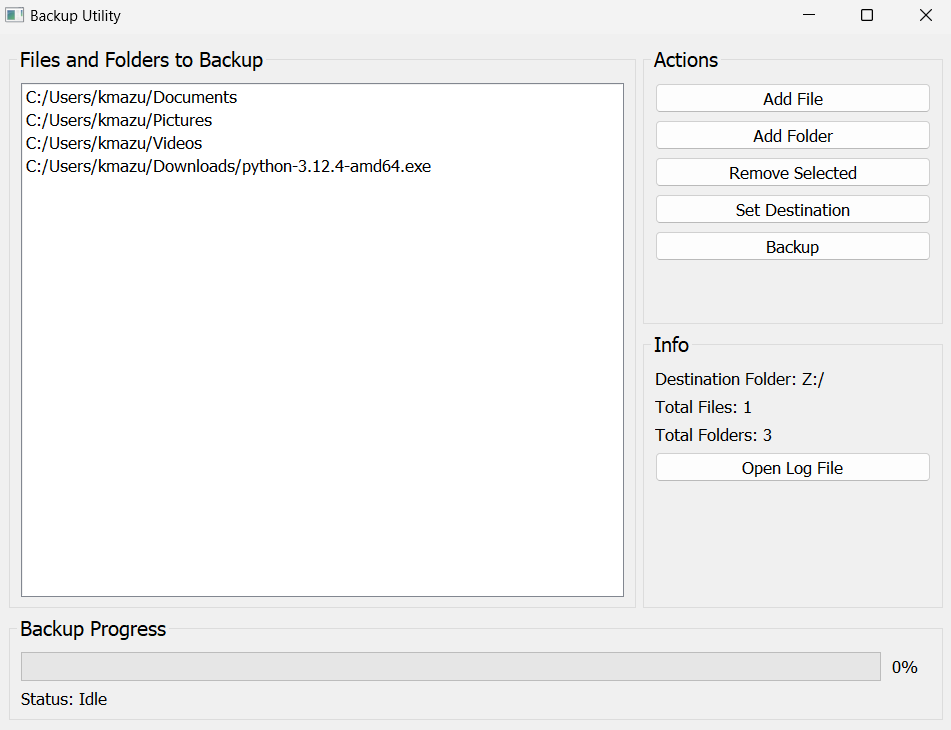
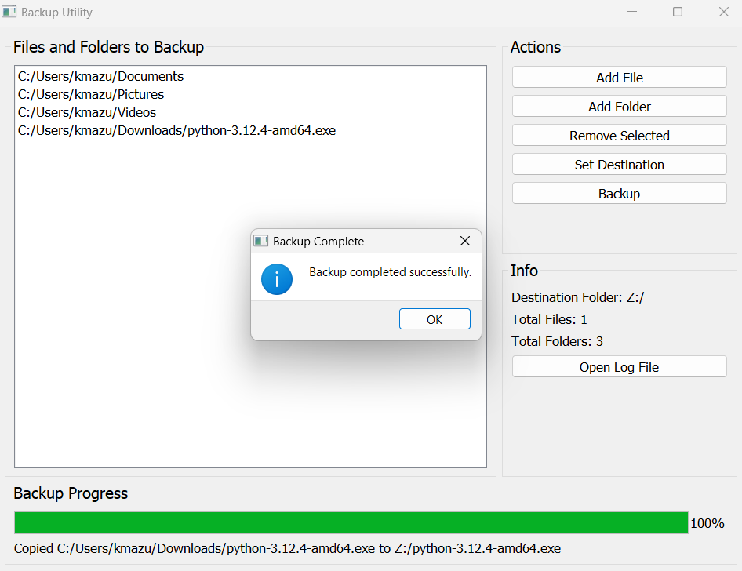

# Backup Utility 2

Backup Utility 2 is a Python-based backup software built with PyQT. It allows you to add and remove files or folders to be backed up to a designated destination, which can be a different drive or a network drive. The software provides an intuitive interface to manage your backup tasks efficiently.

## Features

- **Add and Remove Files/Folders:** Easily select files or folders to include or exclude from the backup.
- **Destination Setup:** Set the backup destination to a different drive or a network drive within the software.
- **Progress Bar:** Monitor the backup progress with a progress bar that displays the current file being copied or skipped.
- **Backup Information:** View details such as the destination folder, number of files, and number of folders being backed up.
- **Log File Access:** Access the log file directly from the program with a simple button click.

## Installation

### Prerequisites

- Python 3.x
- PyQT5

### Building from Source

1. Clone the repository:

    ```bash
    git clone https://github.com/Kmzii/Backup-Utility-2.git
    cd Backup-Utility-2
    ```

2. Install the required dependencies:

    ```bash
    pip install -r requirements.txt
    ```

3. Run the application:

    ```bash
    python backup-utility-2.py
    ```

### Using the Executable

Alternatively, you can use the pre-built executable available in the `dist` folder. Simply download and run the executable to start using Backup Utility 2.

## Usage

1. Launch the application.
2. Add files or folders you want to back up.
3. Set the destination for the backup.
4. Start the backup process and monitor the progress.
5. Access the log file if needed by clicking the log file button.

## Screenshots



## Contributing

Contributions are welcome! Please fork the repository and submit a pull request for review.

## Contact

For any questions or suggestions, please open an issue or contact me at [kmazumdersocials@example.com](mailto:kmazumdersocials@example.com).
